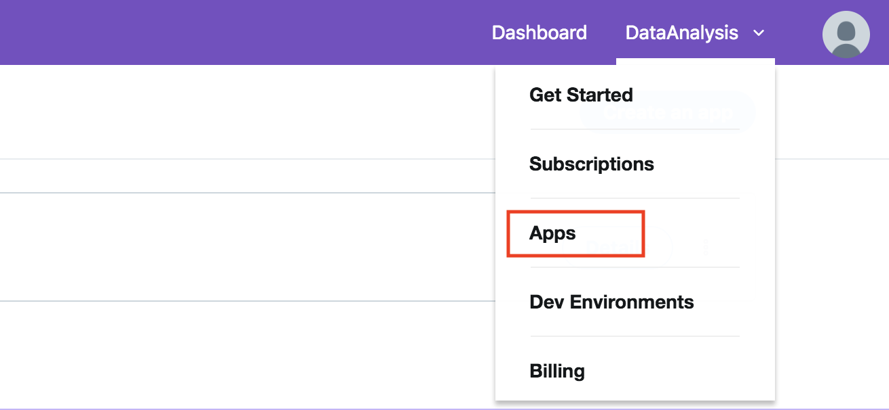
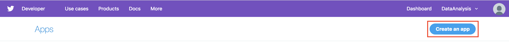
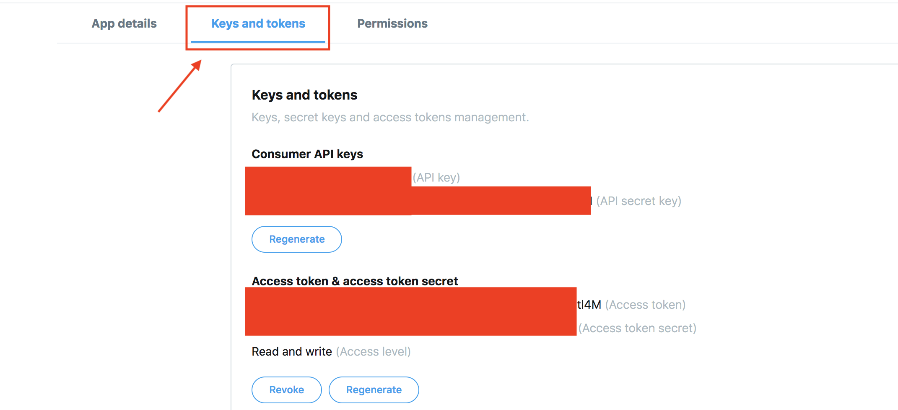

# Real Time Twitter data streaming using Python, APEX and Oracle DB

Last Updated:<br>March 01, 2019 
</td>
<td class="td-banner">
# Twitter real time data streaming - Oracle DB + APEX + ORDS + PYTHON
</td></tr><table>

Project to implement real time twitter data streaming using python and Oracle APEX on Oracle Autonomous Database deployed on Oracle Cloud Infrastructure (OCI).


## Introduction

These instructions will get you a copy of the project up and running on your local or any machine/system for development and testing purposes. See deployment for notes on how to deploy the project on a live system.

## Prerequisites

What things you need to install the software and how to install them


- OCI Database or Autonomous Database.
    - Learn more about provisioning and using Oracle DB by visiting [Documentation](https://docs.oracle.com/en/cloud/paas/database-dbaas-cloud/csdbi/create-db-deployment-overview.html) website

- Register a Twitter Application to pull tweets.

- For Oracle database on OCI  - Install Oracle APEX on the server where databse is hosted and ORDS on your local or any remote system.

- Configure ORDS to send request to the database instance and to interact with APEX.

- Procedure to install and configure ORDS can be found at this [website](https://docs.oracle.com/database/ords-18.1/AELIG/installing-REST-data-services.htm#AELIG7217) and APEX can be found at this [website](https://docs.oracle.com/en/database/oracle/application-express/18.2/htmig/Installing-AE-and-configuring-LWL-Oracle-HTTP-Server.html#GUID-CDBBB7FD-B436-47F8-AA84-A996AECC8D81)

- Alternatively, you can use the terraform script available at [this]() github repository. Please check the readme to know how to run the script.

- **For Autonomous Database - APEX is provided to you out of the box (you do not have to install it) and can be accessed via the Autonomous Database console.**


## Package Contents

* import-export
  * Real_Time_TweetStreaming_using_Rest_Service.py
    * Connect to Twitter Application
    * Collect Real Time Data from Twitter
    * Insert data in Real Time into Oracle DB using the REST endpoint.
* source
  * Real Time Twitter Data 

## Components
* Data Source&nbsp; &nbsp; &nbsp; &nbsp; &nbsp; &nbsp; &nbsp; &nbsp; &nbsp; &nbsp; &nbsp; &nbsp; &nbsp; &nbsp; &nbsp; &nbsp; &nbsp; &nbsp; &nbsp;: Twitter
* Data Collection and Processing     &nbsp; &nbsp; : Python
* Data Storage                       &nbsp;&nbsp; &nbsp; &nbsp; &nbsp; &nbsp; &nbsp; &nbsp; &nbsp; &nbsp; &nbsp; &nbsp; &nbsp; &nbsp; &nbsp; &nbsp; &nbsp; &nbsp; : Oracle Database on Oracle Cloud Infrastructure


## Steps to Create/Get the Twitter Authentication Keys

- Login to Twitter and register for a developer account. Please view [this link](https://docs.inboundnow.com/guide/create-twitter-application/) to know more about registering for a developer account.

- Once you create a developer account, create an app in the developer account.
  
   
  
  

- Click on Details button

   

- Click on "Keys and Token"

   


## Steps to Deploy

- Open terminal
- Move to the folder where you want to download the application.
- Create a directory for the application

  ```
  mkdir /DBCSTwitter
  ```
- Move to that directory

  ```
  cd /DBCSTwitter
  ```
- Clone the Github Repository

  ```
  git clone https://github.com/Abdul-Rafae-Mohammed/TweetStreamingusingPythonintoOracleDBusingORDS.git
  ```
- Go inside the downloaded repository

  ```
  cd <repo name>/
  ```
  
- Open the Config File

  ```
  vi config_rest.txt
  ```
- Enter the keyword(For pulling the tweets),Twitter Application Auth Tokens(Can be found in your twitter app),DB connection Details, the rest endpoint for the database. The data should look similar to below example:
  
- Note: Attributes in below snippet should be replaced with appropriate data for your application/database.

  ```
  keyword=ipl
  consumer_key=P5SFPo.................NaRkB
  consumer_secret=k7G.................KIkXIcdwydOLM8M
  access_token=8342334757797.....................4M
  access_secret=QPfmfzWb.........................uj
  post_endpoint=http://xxx.xxx.xxx.xxx:xxxx/ords/xxxx/twitter/demo
  ```
  
- Then save the file. 

  ```
  Press Ctrl+S to save.
  ```

- Run python app

  ```
  python Real_Time_TweetStreaming_using_Rest_Service.py config_rest.txt
  ```

- Verify data in your database by using logging in using SSH in the terminal or using SQL Developer.

## Authors

**Abdul Rafae Mohammed (abdul.rafae@outlook.com)**


