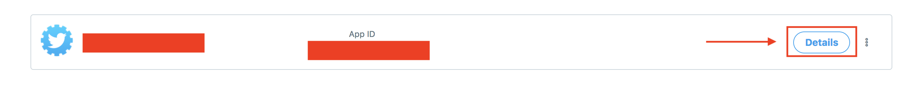

# Real Time Twitter Sentiment Analysis using Python, ORDS and Oracle DB Deployed using Docker

Last Updated:<br>March 01, 2019 
</td>
<td class="td-banner">
# Twitter real time analysis - Docker + DBCS + ORDS + PYTHON
</td></tr><table>

Project to implement real time twitter data analysis using python and Oracle REST Data Services(ORDS) on Oracle Autonomous Database deployed on Oracle Cloud Infrastructure (OCI) using Docker.


## Introduction

These instructions will get you a copy of the project up and running on your local or any machine/system for development and testing purposes. See deployment for notes on how to deploy the project on a live system.

## Prerequisites

What things you need to install the software and how to install them


- OCI Autonomous Transaction Processing Database.
    - Learn more about provisioning and using Oracle ATP by visiting [ATP Documentation](https://docs.oracle.com/en/cloud/paas/atp-cloud/atpug/getting-started.html#GUID-F370F478-2B17-48EA-A7C0-BCE0C1E3C72F) website

- Docker.
    - Learn more about installing and using Docker by viewing this [website](https://docs.docker.com/install/)
  
- Register a Twitter Application to pull tweets.

- Install Oracle APEX on the server where databse is hosted and ORDS on your local or any remote system

- Configure ORDS to send request to the database instance and to interact with APEX.

- Procedure to install and configure ORDS can be found at this [website](https://docs.oracle.com/database/ords-18.1/AELIG/installing-REST-data-services.htm#AELIG7217) and APEX can be found at this [website](https://docs.oracle.com/en/database/oracle/application-express/18.2/htmig/Installing-AE-and-configuring-LWL-Oracle-HTTP-Server.html#GUID-CDBBB7FD-B436-47F8-AA84-A996AECC8D81)


## Package Contents

* import-export
  * Real_Time_Twitter_Sent_Json_Rest.py
    * Connect to Oracle Autonomous DB 
        * Create the table to store data
        * Use the REST endpoint configured in APEX and ORDS for DB operations.
    * Connect to Twitter Application
    * Collect Real Time Data from Twitter
    * Insert data in Real Time into Oracle Autonomous DB using the REST endpoint.
* notebook
  * Indian Premier League.json - SQL notebook
    * Perform Data Analysis and Visualization
* reset
  * Real_Time_Twitter_Sent_Json_Rest_Reset.py - drop tables and remove data
* source
  * Real Time Twitter Data 

## Components
* Data Source&nbsp; &nbsp; &nbsp; &nbsp; &nbsp; &nbsp; &nbsp; &nbsp; &nbsp; &nbsp; &nbsp; &nbsp; &nbsp; &nbsp; &nbsp; &nbsp; &nbsp; &nbsp; &nbsp;: Twitter
* Data Collection and Processing     &nbsp; &nbsp; : Python
* Data Storage                       &nbsp;&nbsp; &nbsp; &nbsp; &nbsp; &nbsp; &nbsp; &nbsp; &nbsp; &nbsp; &nbsp; &nbsp; &nbsp; &nbsp; &nbsp; &nbsp; &nbsp; &nbsp; : Oracle Database on Oracle Cloud Infrastructure
* Data Visualization/Reporting       &nbsp; &nbsp; &nbsp; &nbsp; &nbsp;: Oracle SQL Notebook
* Application Deployment             &nbsp; &nbsp; &nbsp; &nbsp; &nbsp; &nbsp; &nbsp; &nbsp; &nbsp;: Docker 


## Steps to Create/Get the Twitter Authentication Keys

- Login to Twitter and register for a developer account. Please view [this link](https://docs.inboundnow.com/guide/create-twitter-application/) to know more about registering for a developer account.

- Once you create a developer account, create an app in the developer account.
  
   
  
  

- Click on Details button

   

- Click on "Keys and Token"

   


## Steps to Deploy

- Open terminal
- Move to the folder where you want to download the application.
- Create a directory for the application

  ```
  mkdir /DBCSTwitter
  ```
- Move to that directory

  ```
  cd /DBCSTwitter
  ```
- Clone the Github Repository

  ```
  git clone https://abdul.rafae.mohammed%40oracle.com@alm.oraclecorp.com/natd-soleng/s/natd-soleng_information-management-reston_19373/scm/DBCS_Workshop_using_ORDS_APEX.git
  ```
- Go inside the DBCS_Workshop_using_ORDS_APEX Directory

  ```
  cd DBCS_Workshop_using_ORDS_APEX/
  ```
  
- Start Docker Application

- If you have any existing docker images you can remove it by running the following commands:  

  ```
  docker rm -f $(docker ps -a -q)

  docker rmi -f $(docker images -q)
  ```
- Build the docker image by run the following command 

  ```
  docker build -t twitter .
  ```

- Deploy and run the application by using the following command 

  ```
  docker run -i -p 3050:3050 -t twitter sh
  ```

- Go inside the docker image directory

  ```
  cd /opt/oracle/lib/TweetStreaming_using_ORDS_and_OracleDB/
  ```
  
- Open the Config File

  ```
  nano config_rest.txt
  ```
- Enter the keyword(For pulling the tweets),Twitter Application Auth Tokens(Can be found in your twitter app),DB connection Details, the rest endpoint for the database. The data should look similar to below example:
  
- Note: Attributes in below snippet should be replaced with appropriate data for your application/database.

  ```
  keyword=ipl
  consumer_key=P5SFPo.................NaRkB
  consumer_secret=k7G.................KIkXIcdwydOLM8M
  access_token=8342334757797.....................4M
  access_secret=QPfmfzWb.........................uj
  username=xxxx
  password=xxxx
  service_name=pdb1.........................oraclevcn.com
  port=xxxx
  ip=xxx.xxx.xxx.xxx
  curse_words_dict=curse_words.txt
  racial_slurs_dict=racial_slurs.txt
  post_endpoint=http://xxx.xxx.xxx.xxx:xxxx/ords/xxxx/twitter/demo
  get_endpoint=http://xxx.xxx.xxx.xxx:xxxx/ords/xxxx/twitter/demo
  ```
  
- Then save the file. 

  ```
  Press Ctrl+O to save and Ctrl+X to exit.
  ```

- Run python app

  ```
  python Real_Time_Twitter_Sent_json_rest.py config_rest.txt
  ```

- Verify data in your database by using logging in using SSH in the terminal or using SQL Developer.

## Steps to Reset

- Execute the reset file to delete the table along with the data.

  ```
  python Real_Time_Twitter_Sent_json_rest_Reset.py config_rest.txt
  ```

## Authors

**Abdul Rafae Mohammed (abdul.rafae@outlook.com)**


